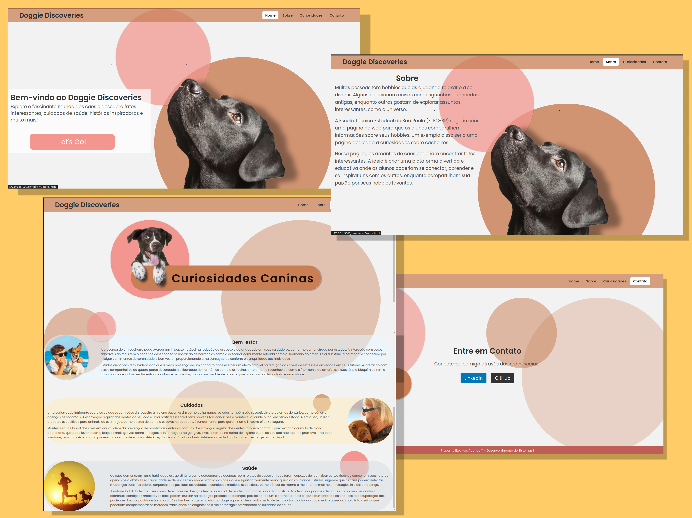

# Doggie Discoveries
 

Este projeto consiste em uma página web dedicada a fornecer informações sobre curiosidades relacionadas a cães. Foi desenvolvido como parte de um trabalho da Etec-sp, disciplina Agenda 11 - Desenvolvimento de Sistemas I.

## Funcionalidades Implementadas:

1. **Página Inicial (index.html):**
   - Apresenta uma introdução ao site e um convite para explorar mais.
   - Abas de navegação no topo para diferentes seções do site.

2. **Página "Sobre" (sobre.html):**
   - Informações sobre os requisitos do projeto e sua finalidade.
   - Breve descrição do conteúdo da página.

3. **Página de Curiosidades (curiosidades.html):**
   - Exibe curiosidades sobre cuidados, bem-estar e saúde dos cães.
   - Cada seção de curiosidade possui uma imagem de fundo e texto explicativo.

4. **Página de Contato (contato.html):**
   - Permite que os visitantes se conectem através de redes sociais.
   - Links para LinkedIn e GitHub da responsável pelo projeto.

## Principais Alterações Realizadas:

1. **Estilo Visual:**
   - Adicionou-se estilos CSS para melhorar a aparência e a legibilidade do site.
   - Utilizou-se a fonte 'Poppins' para uniformizar a apresentação do texto em todas as páginas.

2. **Script JavaScript:**
   - Foram implementadas funcionalidades interativas utilizando JavaScript

3. **Posicionamento dos Elementos:**
   - Centralizou-se o conteúdo das páginas verticalmente utilizando flexbox.
   - Ajustou-se o posicionamento das abas de navegação para permanecerem no topo da página.

4. **Responsividade:**
   - Garantiu-se que o site seja visualizado corretamente em dispositivos de diferentes tamanhos, utilizando media queries e unidades relativas.

5. **Design no Figma:**
   - O design e layout das páginas foram inicialmente criados e prototipados no Figma para orientar o desenvolvimento.

## Tecnologias Utilizadas:

- HTML5
- CSS3
- JavaScript
- Figma

## Autora 

© 2024 Este projeto é parte de um trabalho acadêmico da Etec-sp.