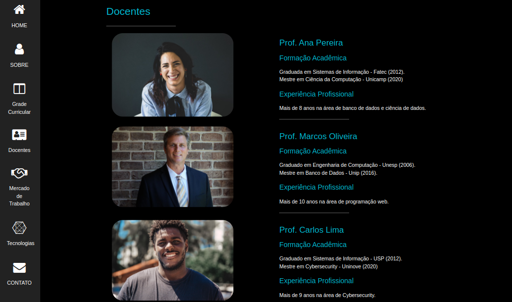
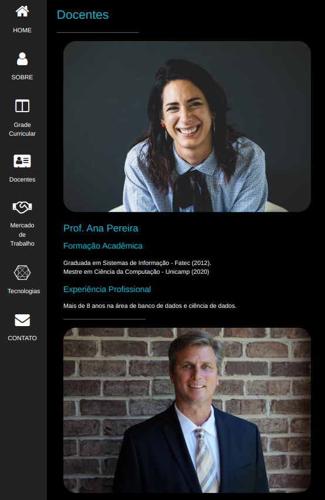
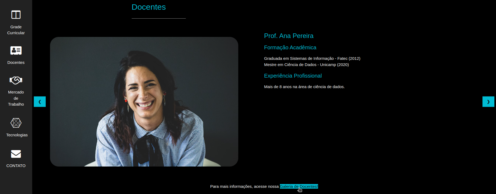

# Projeto CPS - Seção Docentes I

 
Este projeto é uma continuação do PROJETO CPS, da agenda 15 de Desenvolvimento de Sistemas I. A tarefa consiste em adicionar uma nova seção chamada "Docentes" ao site, seguindo as solicitações e padrões estabelecidos em aula.

## Solução Implementada

### Estrutura do HTML

Foi criada uma nova seção "Docentes" no arquivo HTML, posicionada entre "Grade Curricular" e "Mercado de Trabalho". A navbar também foi atualizada para incluir o link para a nova seção.

### CSS Adicional

Para garantir que as imagens sejam responsivas e o layout se ajuste corretamente em telas menores, foram adicionadas classes CSS específicas e media queries.

### Conclusão

A nova seção "Docentes" foi implementada com sucesso, seguindo as solicitações do Centro Paula Souza. A seção foi integrada ao site de forma padronizada, utilizando HTML5, CSS3 e o framework W3.CSS para garantir a responsividade e a consistência visual com o restante do site.

 
 
 

----
# Projeto CPS - Seção Docentes II

 
O Centro Paula Souza aprovou a forma como você criou a nova seção “Docentes”, sendo apontada apenas uma observação: Como há na instituição uma grande quantidade de docentes, a página ficaria muito extensa.

Com o conhecimento adquirido nesta agenda, altere a página criada durante a atividade da agenda 15, atendendo aos requisitos exigidos.

## Solução Implementada

### Estrutura do HTML
Para a página não ficar muito extensa, modifiquei a distribuição das informações, de forma padronizada, inserindo um Slideshow com a foto de cada docente, seu nome e uma breve descrição de sua formação e atuação profissional na seção Docente.

Com esse propósito, foi necessária a inclusão de um script para controlar a navegação e a exibição dinâmica dos slides. O HTML e o CSS sozinhos não são suficientes para criar a interatividade responsável por responder a eventos do usuário, como cliques em botões para avançar ou retroceder slides, sendo necessário o JavaScript. 

Além disso, foi criada uma página específica para armazenar as imagens, possibilitando detalhar melhor a atuação profissional de cada docente. Abaixo deixei uma visualização de um breve trecho desse complemento no código.

### Script

O código JavaScript controla a exibição de slides em um carrossel de imagens. A variável `slideIndex` é inicializada com o valor 1, indicando o primeiro slide. A função `showDivs(slideIndex)` é chamada para exibir o slide inicial. A função `plusDivs(n)` ajusta o índice do slide atual ao adicionar ou subtrair um valor `n`, depois chama `showDivs(slideIndex)` para atualizar a exibição. A função `showDivs(n)` oculta todos os elementos com a classe "mySlides" e mostra apenas o slide correspondente ao `slideIndex` atual. Se o índice `n` exceder o número total de slides, `slideIndex` é ajustado para o primeiro slide, e se for menor que 1, `slideIndex` é ajustado para o último slide. Isso garante que a navegação dos seja cíclica e contínua.

### CSS Adicional

Para garantir que as imagens sejam responsivas e o layout se ajuste corretamente em telas menores, foram adicionadas classes CSS específicas e media queries.

### Conclusão

A seção "Docentes" foi alterada e a página "Galeria" foi adicionada com sucesso, seguindo as solicitações do Centro Paula Souza. As modificações foram integrada ao site de forma padronizada, utilize o slideshow manual e no botão coloque a cor w3-cyan para uma melhor visualização e padronização do projeto.

## Autora

© 2024 Este projeto é parte de um trabalho acadêmico da Etec-sp.

