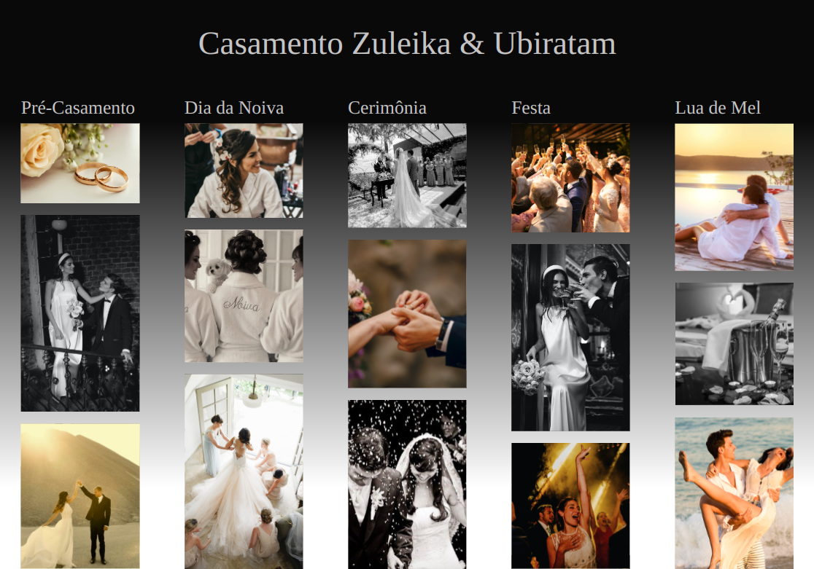

# Site de Casamento

Este projeto consiste em uma página web dedicada ao casamento de Zuleika e Ubiratam. O site apresenta uma galeria de fotos dividida em categorias que representam diferentes momentos do evento, desde o pré-casamento até a lua de mel. Foi desenvolvido como parte de um trabalho da Etec-sp, disciplina Agenda 13 - Desenvolvimento de Sistemas I.

## Recursos

- **Galeria de Fotos**: Imagens organizadas por categorias que capturam os momentos especiais do casamento.
- **Design Responsivo**: O site é totalmente responsivo e funciona bem em dispositivos de todos os tamanhos.
- **Fontes Personalizadas**: Utiliza a fonte "Smooth Loving" para adicionar um toque de elegância e sofisticação.

## Tecnologias Utilizadas

- HTML5
- CSS3
- Bootstrap 5
- JavaScript
- Figma

## Estrutura do script

As imagens são inseridas dinamicamente no DOM (Document Object Model) em suas respectivas categorias, por meio de um script que percorre um array chamado “sections”. O script estabelece o número total de imagens disponíveis e calcula quantas imagens serão atribuídas a cada seção, dividindo o número total pelo número de seções.

Cada imagem recebe um atributo “src”, indicando o caminho para o arquivo correspondente, e um atributo “alt”, fornecendo uma descrição baseada no nome da seção e na posição da imagem. Inicialmente, é atribuida a classe “loading” e quando completado o carregamento, a classe é substituída pela “loaded”. Esse processo automatiza a adição de imagens à página, assegurando que sejam exibidas nas categorias corretas e com o estilo apropriado.

## Instruções de Uso

1. Clone o repositório para o seu computador local.
2. Abra o arquivo `index.html` em um navegador para visualizar o site.
3. Explore as diferentes categorias da galeria de fotos.

## Contribuições

Contribuições são sempre bem-vindas! Se você tem uma sugestão para melhorar o site, sinta-se à vontade para fazer um fork do repositório e enviar um pull request.

## Autora

---
© 2024 Este projeto é parte de um trabalho acadêmico da Etec-sp.