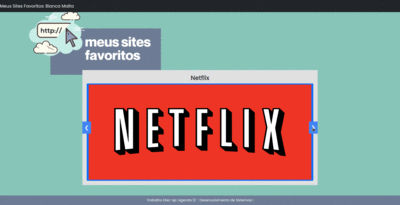

# Meus Sites Favoritos

### Descrição



Durante o desenrolar da atividade, optei por aprofundar meus conhecimentos e explorar a implementação de um carrossel para exibir os sites favoritos de forma mais dinâmica e interativa. Em busca de facilitar o desenvolvimento e garantir uma aparência consistente e moderna, empreguei o framework Bootstrap, que fornece uma ampla gama de componentes e estilos pré-definidos. 

O projeto consiste em uma página web que exibe uma seleção de sites favoritos. Cada site é representado por um painel, contendo o nome, uma imagem e seu respectivo link.

### Tecnologias Utilizadas

- HTML5
- CSS3 (Bootstrap)
- JavaScript (Vanilla JS)

### Fonte

A fonte utilizada neste projeto é a "Poppins", uma fonte moderna e elegante disponível no Google Fonts. Ela foi escolhida por sua legibilidade e estética limpa, que se encaixam bem com o estilo geral do projeto.

### Ferramentas de Design

As imagens SVG foram desenvolvidas utilizando o Figma, uma ferramenta de design de interface do usuário baseada em navegador.

### Instruções de Uso

Para visualizar o projeto, abra o arquivo `index.html` em um navegador da web.

### Como Contribuir

1. Faça um fork do repositório
2. Crie uma branch para sua feature 
```
git checkout -b feature/nova-feature
``````
3. Faça commit das suas alterações 
```
git commit -am 'Adiciona nova feature'
```
4. Faça push para a branch 
```
git push origin feature/nova-feature
```
5. Crie um novo Pull Request

### Autora 

[](https://www.linkedin.com/in/bianca-malta/)

--- 

© 2024 Este projeto é parte de um trabalho acadêmico da Etec-sp.

